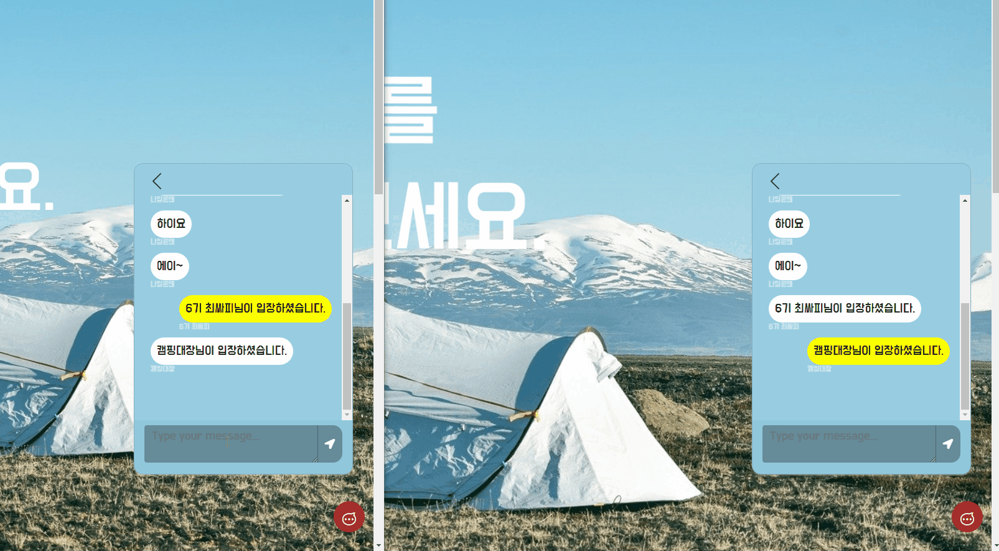
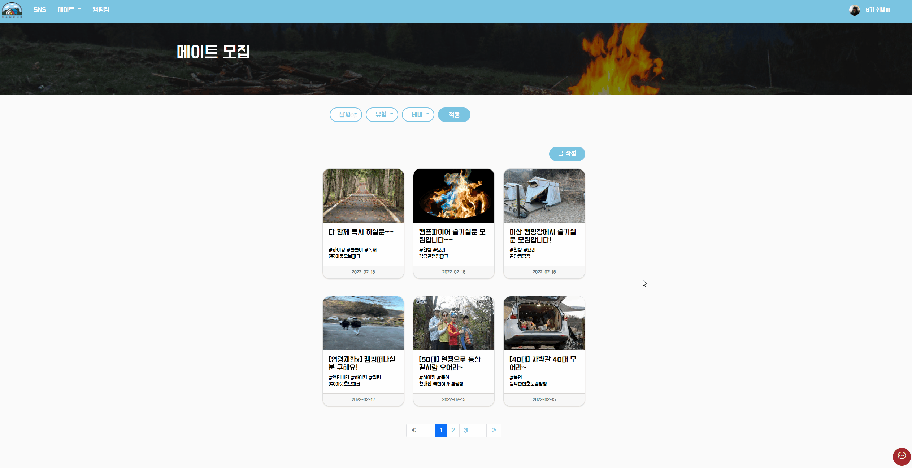

# Camp-us

## 한 줄 소개

### **`캠핑일상을 공유하고 캠핑을 해보고 싶을 때 취향이 맞는 사람들과 캠핑을 계획할 수 있는 서비스`**

<br/>


## 기획 배경

1. 비슷한 취향의 캠퍼들을 찾을 수 있는 서비스의 부재

2. 캠핑장, 주변시설에 대한 정보의 부재

<br />

## 서비스 특징

1. 사용자들은 본인의 취향에 맞는 캠핑 메이트들을 소개 받을 수 있다.

2. 사용자들은 캠핑메이트를 모집하여 다른 사람들과 본인이 기획한 캠핑을 즐길 수 있다.

3. 캠핑SNS를 통해 나만의 장소나 캠핑이야기 들을 공유할 수 있다.

4. 캠핑장 소개를 통해 국내의 다양한 캠핑장 정보, 이용한 유저의 리뷰등을 알 수 있다.

<br />

# 팀원 소개
* 조해성 : 팀장, 프론트엔드 개발 및 유지보수
* 최호준 : 부팀장, 백엔드 개발 및 DB 설계
* 곽동현 : 프론트엔드 개발 및 Git
* 김도훈: 프론트엔드 개발 및 와이어프레임 작성
* 전양희: 백엔드 개발, 서버관리, Docker 구성

<br />

## 프로젝트 진행기간
- 2022.01.10 ~ 2022.02.18

<br />

## 주요 기술 스택 및 협업툴
#### 기술 스택

- front-end
  - Vue
  - node.js
- back-end
  - Spring boot
  - MySQL
  - Firebase
  - Docker

- 협업 툴
  - JIRA
  - MatterMost
  - Gitlab
  - Notion

<br />

## 기능 소개

<br />


### 메인 페이지


1. 로그인, 로그아웃이 가능하다.
2. '지금뜨는 메이트'항목을 눌러 메이트 페이지로 이동이 가능하다.

<br />


### 채팅



1. 현재 참가(참가 예정)인 메이트의 멤버들과 실시간 채팅이 가능하다.
2. 타인의 프로필에서 채팅 버튼을 눌러 실시간 채팅을 시작할 수 있다.

<br />


### 메이트 매칭


1. 나와 취향이 비슷한 캠퍼를 추천 받을 수 있다.
2. 매칭 적합도를 알 수 있으며 해당 유저의 프로필로 이동이 가능하다.

<br />

### 메이트 모집



1. 내가 원하는 취향의 캠핑에 참여할 수 있다.

2. 캠핑 테마, 참가 인원의 대략적인 정보를 알 수 있다.

3. 연령, 동행인원 제한에 적합할 경우 캠핑에 참여할 수 있다.

<br />


### SNS 페이지


1. 캠핑에 관련된 사진과 글을 공유할 수 있다.
2. 내가 팔로우한 유저의 글을 우선적으로 볼 수 있다.


</br>


## 웹 소켓 코드

### Vue
```javascript

// 웹 소켓 연결(해당 채팅방의 번호를 인자로)

socketConnect(roomid){
      // socket 연결

      if (this.socketStop.includes(roomid) === false) {
  
        // 고유 URL로 subscribe
        let socket = new SockJS(`${SERVER_URL}/ws`)
        this.stompClient = Stomp.over(socket)
        
        // 메시지를 전달
        this.stompClient.connect({}, frame=>{
          this.stompClient.subscribe("/sub/"+roomid, res=>{
            let jsonBody = JSON.parse(res.body)
            let m={
              'senderNickname':jsonBody.senderNickname,
              'content': jsonBody.content,
              'style': jsonBody.senderId == this.$store.state.userList.userNo ? "d-flex justify-content-end mb-4 my":'d-flex justify-content-start mb-4 your'
            }
            
              console.log(m)
              this.MessageList.push(m)
            
          })
        }, err=>{
          console.log("fail", err)
        })
        }
    },

```

<br/>

```javascript
// 채팅방 확인 후 메시지 전송

sendMessage(){
      const roomNo = this.temps.id
      const roomTitle = this.temps.title

      if(this.content.trim() !='' && this.stompClient!=null) {
          
          let chatMessage = {
            'title' : roomTitle,
            'content': this.content,
            'chatroomId' : roomNo,
            'senderNickname':this.$store.state.userList.userNickname,
            'senderId': this.$store.state.userList.userNo,
            'id':"0"
          }

          this.stompClient.send("/pub/message", JSON.stringify(chatMessage),{})
          this.content = ''
      }
      let MessageList = this.$refs.MessageList
      MessageList.scrollTo({ top: MessageList.scrollHeight, behavior: 'smooth' });

```


### SpringBoot

</br>

```java
// 웹 소켓 연결 

public class WebSocketConfig implements WebSocketMessageBrokerConfigurer {
	@Override
	public void registerStompEndpoints(StompEndpointRegistry registry) {
		registry.addEndpoint("/ws").setAllowedOriginPatterns("*").withSockJS();
	}

	@Override
	public void configureMessageBroker(MessageBrokerRegistry registry) {
		registry.setApplicationDestinationPrefixes("/pub"); // publisher : message-handling methods로 라우팅됨
		registry.enableSimpleBroker("/sub"); // subscriber : topic으로 시작되는 메시지가 메세지브로커로 라우팅됨
	}

	@Override
	public void configureClientInboundChannel(ChannelRegistration registration) {
		registration.interceptors(new MyChannelInterceptor());
	}
}
```

<br/>

```java
// 웹 소켓 controller

public class MessageController {
	private final IMessageService messageService;
	private final SimpMessagingTemplate template;

	@MessageMapping("/message")
	public void sendMessage(@Payload Message chatMessage) {
		log.info("전달 메세지 : " + chatMessage);

		messageService.insertMessage(chatMessage);
		template.convertAndSend("/sub/" + chatMessage.getChatroomId(), chatMessage);
	}
}
```

</br>

```java
// 웹 소켓 메세지 전송

public Message preSend(Message<?> message, MessageChannel channel) {
		StompHeaderAccessor accessor = StompHeaderAccessor.wrap(message);
		StompCommand command = accessor.getCommand();
		if (command.compareTo(StompCommand.SUBSCRIBE) == 0) {
			String destination = accessor.getDestination();
			System.out.println("구독 주소 : " + destination);
			System.out.println(message);
		} else if (command.compareTo(StompCommand.CONNECT) == 0) {
			System.out.println("사용자 연결");
		} else if (command.compareTo(StompCommand.DISCONNECT) == 0) {
			System.out.println("사용자 연결 해제");
		}
		return message;
	}
```
